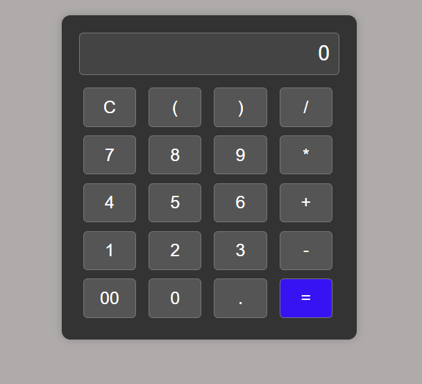

# TechnoHacks-Interns
# Internship Projects

**Completed Tasks During Internship: Basic Calculator, Currency Converter, and Registration Form**
<p align="center">
  
  
</p>

<p align="center">
  
</p>


## Overview

During my internship, I successfully completed several projects to enhance my programming skills and practical knowledge. These projects include a Basic Calculator, a Currency Converter, and a Registration Form. Each project helped me develop a deeper understanding of programming concepts and application development.

## Projects

### 1. Basic Calculator

- **Description:** A simple calculator application that performs basic arithmetic operations including addition, subtraction, multiplication, and division.
- **Features:**
  - Performs addition, subtraction, multiplication, and division.
  - User-friendly interface for easy input and display of results.
- **Technologies Used:** HTML, CSS, JavaScript

### 2. Currency Converter

- **Description:** An application that converts amounts between different currencies using real-time exchange rates.
- **Features:**
  - Converts between multiple currencies.
  - Retrieves real-time exchange rates using an external API.
  - User-friendly interface for input and conversion.
- **Technologies Used:** HTML, CSS, JavaScript, API Integration

### 3. Registration Form

- **Description:** A registration form that collects user information and validates the input data before submission.
- **Features:**
  - Collects user information such as name, email, and password.
  - Includes input validation for required fields and correct formats.
  - Provides feedback on successful or failed submission.
- **Technologies Used:** HTML, CSS, JavaScript

## Skills Acquired

- **Front-End Development:** Proficiency in building interactive web applications using HTML, CSS, and JavaScript.
- **API Integration:** Experience in integrating external APIs for dynamic data retrieval.
- **Form Validation:** Knowledge of input validation techniques to ensure data integrity and improve user experience.

## Installation and Usage

1. Clone the repository:

    ```bash
    git clone https://github.com/your-repo/internship-projects.git
    ```

2. Navigate to the project directory:

    ```bash
    cd internship-projects
    ```

3. Open the respective project files in a web browser:

    - **Basic Calculator:** Open `calculator.html`
    - **Currency Converter:** Open `currency-converter.html`
    - **Registration Form:** Open `registration-form.html`


